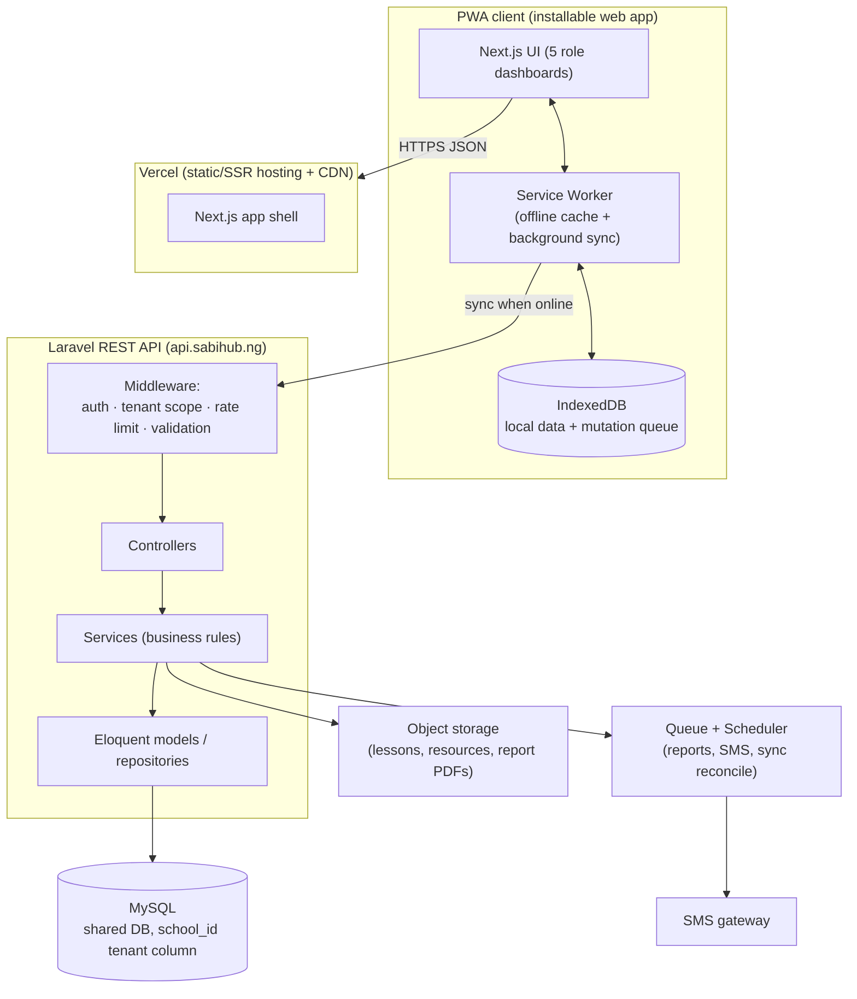
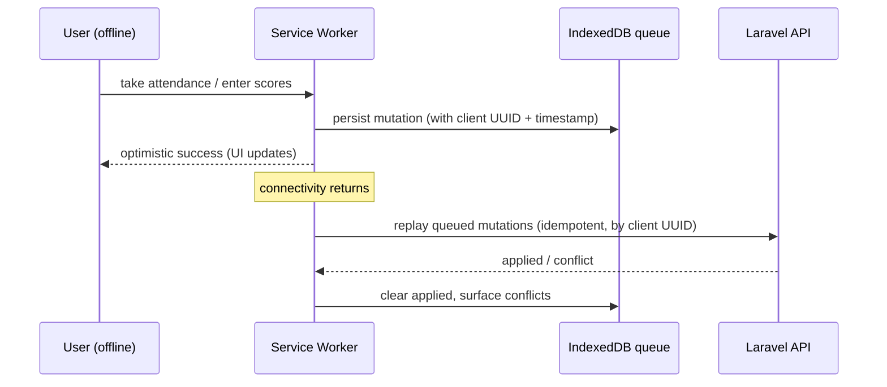

# SabiHub — System Architecture

Status: draft v1 · Last updated: 2026-07-30

## 1. High-level shape

**One sentence:** an installable Next.js PWA talks over HTTPS/JSON to a
tenant-scoped Laravel API on MySQL; the service worker keeps the app usable
offline and replays queued writes on reconnect; a queue handles SMS, report
generation, and sync reconciliation.

## 2. Components & responsibilities

| Component | Responsibility | Notes |
|-----------|----------------|-------|
| **PWA client** | All UI, offline cache, local queue of pending writes | Next.js + service worker (Serwist/next-pwa) + IndexedDB |
| **Laravel API** | The only writer of truth; auth, authorization, tenancy, validation, business rules | Replaces the current raw-PHP `api/` |
| **MySQL** | Durable system of record | Shared DB, `school_id` on every tenant-owned table (see [data-model](data-model.md)) |
| **Queue + scheduler** | Async/scheduled work: SMS alerts, PDF report cards, retention jobs | Laravel queue; cPanel cron drives `schedule:run` at pilot |
| **Object storage** | Files: lesson media, resources, generated report PDFs | Local disk at pilot → S3-compatible when scaling |
| **SMS gateway** | Parent alerts | Pluggable driver |

## 3. Multi-tenancy (NFR-1) — the most important rule

- **Strategy:** shared database, shared schema, **`school_id` discriminator column** on every tenant-owned table. Simplest to operate at pilot; scales to sharding later without model changes.
- **Enforcement is central, not per-query:** a global Eloquent scope + `resolve-tenant` middleware derives the current `school_id` from the authenticated user and automatically filters every query and stamps every insert. A developer *cannot* forget to scope a query.
- **The current `school_id = 1` hardcode is deleted** — tenant comes from the user, always.
- **Cross-tenant access is a tested invariant:** a feature test logs in as School A and asserts it gets 404/empty for School B's records.

## 4. Offline-first (NFR-2) — how it actually works

- **Reads:** app shell + reference data (timetable, roster, content) cached; available offline.
- **Writes:** captured to an IndexedDB queue with a **client-generated UUID** so replays are **idempotent** (the API dedupes on that UUID → no double attendance).
- **Conflict rule (pilot):** last-write-wins per record, except results which are append-then-approve, so conflicts are rare. Documented per entity.
- **Scope:** offline covers the read-heavy student flows and the teacher attendance/score-entry flows first. Admin config is online-only for now.

## 5. Request lifecycle (online)

`PWA → HTTPS → Laravel route → [middleware: authenticate → resolve tenant → rate-limit → validate] → controller → service → model → MySQL → JSON`

Auth is a bearer token (JWT or Laravel Sanctum) stored in an HttpOnly cookie;
the tenant is resolved from the token's user, never from the request body.

## 6. Environments

| Env | Frontend | API | DB | Purpose |
|-----|----------|-----|----|---------| 
| **local** | `next dev` | `php artisan serve` | local MySQL/SQLite | development |
| **staging** | Vercel preview | staging subdomain | separate DB | test before prod; run migrations here first |
| **production** | Vercel (`main`, gated by CI) | `api.sabihub.ng` (cPanel → Laravel `/public`) | prod MySQL | live pilot |

Staging is a new requirement — today changes go straight to prod. See migration plan.

## 7. Security posture (NFR-5) — target

- Per-role authorization via Laravel policies/gates (not ad-hoc role checks).
- **No shared default passwords** — invited users set their own via a one-time tokenised link (replaces `sabihub123`).
- Rate limiting on auth + write endpoints; CSRF protection; centralised request validation (form requests).
- Audit log for sensitive actions (result approval, status changes, logins).
- HTTPS everywhere; encrypt sensitive columns at rest; secrets from env only.

## 8. What we keep vs replace

- **Keep:** the Next.js frontend + design system (strong), the MySQL schema *shape* (port into migrations), the CI/CD gate, the domain knowledge in the current endpoints.
- **Replace:** raw-PHP `api/` → Laravel; `school_id = 1` → real tenancy; online-only → PWA offline; no-tests → tested.
